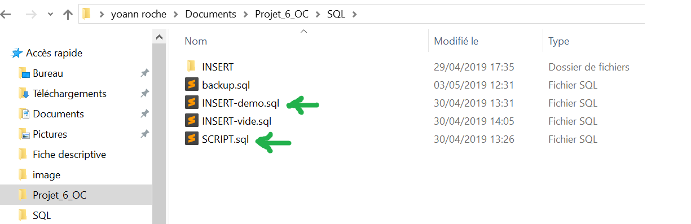

##  Mettre en place l'application

####  1) Créer la base de données :

   1. Ajouter le script qui se trouve dans le fichier SQL/SCRIPT.sql.
   2. Ajouter la démo de la bdd qui se trouve dans le fichier SQL/INSERT-demo.sql.
 
 

####   2) Modifier les variables dans le fichier webapp/META-INF/context.xml :

   1. Mettre l'url de la base de données.
   2. Changer l'username.
   3. Changer le password.
   		
  
  
####  3)  Modifier le despath pour ajouter les images
    
   > Dans la classe escalade-webapp/src/main/java/fr.oc.projet.webapp.action.GestionParticiper.
   
   

####   4) Se connecter à l'application avec un compte admin
    
   > Identifiant : Yocorps  
     Mot de passe : 123
